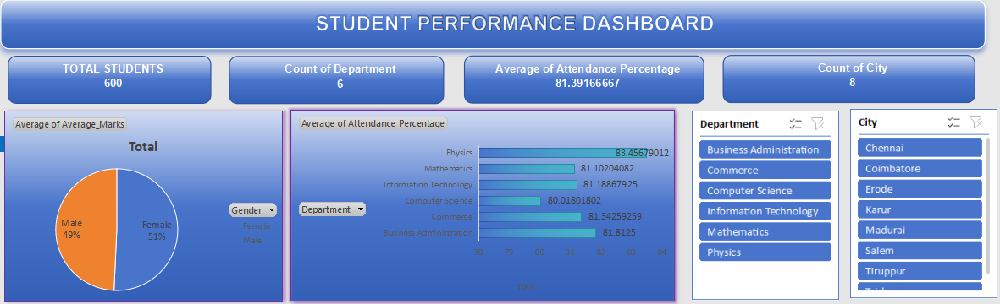

# Student Performance Analysis & Excel Dashboard

## 📊 Project Overview

This project analyzes student performance data using Microsoft Excel/WPS Office and presents the results through an interactive dashboard.

The project demonstrates practical data analyst skills including data organization, formula-based analysis, KPI development, pivot-table analysis, visualization, and dashboard design.

## 🎯 Objective

The objective of this project is to transform raw student marks data into meaningful performance metrics and visual insights.

## 🗂 Dataset

The dataset contains 600 student records with academic performance information.

## 🛠 Tools & Skills

- Microsoft Excel / WPS Office
- Excel Formulas
- Pivot Tables
- Data Analysis
- KPI Development
- Data Visualization
- Dashboard Design

## 📈 Dashboard

The dashboard summarizes important student performance metrics and provides visual analysis of the available data.

## 🔍 Key Analysis

The analysis focuses on:

- Overall student performance
- Average marks
- Highest/lowest performance
- Pass percentage
- Performance distribution
- Category-wise analysis where applicable

## 💡 Key Insights

Insights are derived from the calculated KPIs, pivot tables, and dashboard visualizations.

## 📁 Project Files

| File | Description |
|---|---|
| Student_Performance_Analysis_Dashboard.xlsx | Complete Excel dashboard and analysis |
| dashboard.png | Dashboard preview |
| README.md | Project documentation |

## 👤 Author

Priyadharshini V C
[LinkedIn](https://www.linkedin.com/in/priyadharshini-v-c-6a0037407/)
